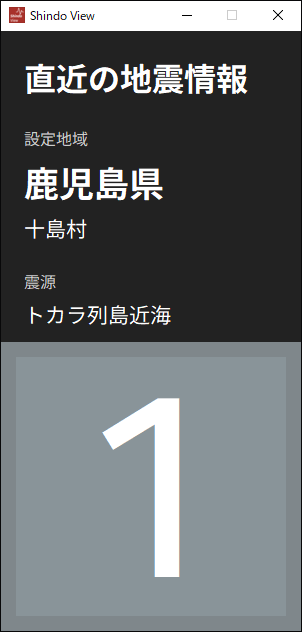

# Shindo View

  

  設定した地域の、直近の地震の最大震度をデスクトップに美しく表示する、シンプルなウィジェットツールです。

  

---

## Shindo View とは

「自分の街は、今の地震でどれくらい揺れたんだろう？」

Shindo Viewは、そんな疑問に瞬時に答えてくれるデスクトップウィジェットです。P2P地震情報APIからリアルタイムで情報を取得し、あなたが設定した地域の最大震度を、美しく、分かりやすく表示します。

## 主な機能

*   **最大震度の表示**: 直近の地震における、設定地域の最大震度を一目で確認できます。
*   **美しいカラー表示**: 震度階級に応じて背景色が変化。EGICカラースキームに準拠した、直感的で美しいデザインです。
*   **柔軟なカスタマイズ**: 観測地域はもちろん、各震度階級の配色（背景、文字、縁取り）や、情報取得先のAPI URLまで、設定画面から自由に変更できます。
*   **各種地震情報に対応**: 震源・震度情報（DetailScale）と、より速報性の高い震度速報（ScalePrompt）の両方に対応しています。
*   **クリーンなUI**: 操作を妨げない、シンプルでモダンなインターフェース。設定は右クリックメニューからスマートにアクセスできます。

## インストールと使い方

1.  **ダウンロード**:
    [**Releasesページ**](https://github.com/EGIC-Info/ShindoView/releases)から、最新バージョンの`shindo_view_v1.0.0.zip`をダウンロードします。

2.  **展開（解凍）**:
    ダウンロードしたZipファイルを、お好きな場所（デスクトップなど）で右クリックし、**「すべて展開」**を選択してください。

3.  **実行**:
    展開してできた`shindo_view`フォルダの中にある、**`ShindoView.exe`**をダブルクリックすると、アプリケーションが起動します。

## ⚠️ Microsoft Defenderの警告（誤検知）について

本ソフトウェアは、Pythonという言語で作成されており、Windowsで単体で実行できる形式に変換する「PyInstaller」または「Nuitka」というツールを使用しています。これらのツールの特性上、一部のウイルス対策ソフト（特にMicrosoft Defender）が、プログラムの挙動をウイルスと誤って検知し、警告を表示する場合があります。

**本ソフトウェアに、ウイルスなどの悪意のあるコードは一切含まれておりません。**
大変お手数ですが、もし警告が表示された場合は、ソフトウェアを信頼して実行していただけますと幸いです。ファイルがブロックされた場合は、Windowsセキュリティの保護履歴から「デバイスで許可」または「復元」を選択してください。

## 設定について

*   アプリケーションのウィンドウを**右クリック**すると表示されるメニューから「設定」を選択することで、設定ウィンドウを開くことができます。
*   地域設定、配色、API URLなど、すべての設定はプログラムと同じフォルダに自動生成される`config.ini`ファイルに保存されます。

## ライセンス

このソフトウェアは [MIT License](LICENSE) のもとで公開されています。

## 謝辞

*   **地震情報**: [P2P地震情報 API](https://www.p2pquake.net/json_api_v2/)
*   **フォント**: [Noto Sans JP](https://fonts.google.com/noto/specimen/Noto+Sans+JP), [Fira Sans](https://fonts.google.com/specimen/Fira+Sans) (Google Fonts)
*   **配色**: EGIC

## 免責事項

本ソフトウェアを利用したことによるいかなる損害も、開発者は一切の責任を負いません。自己の責任においてご利用ください。
